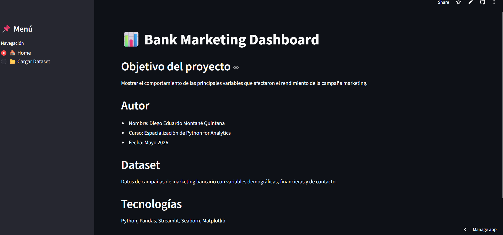
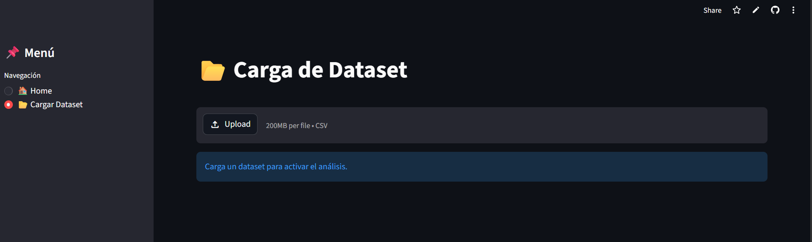
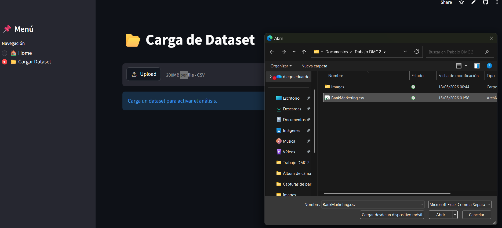
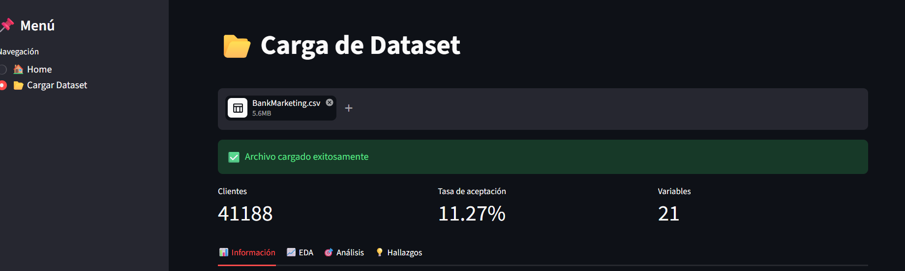
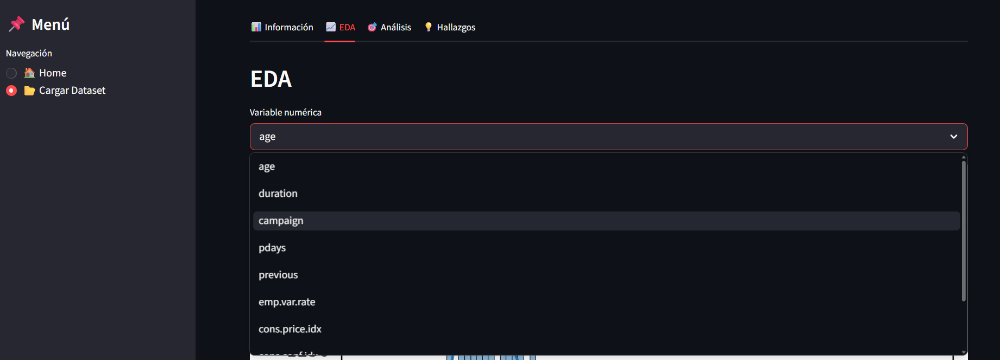
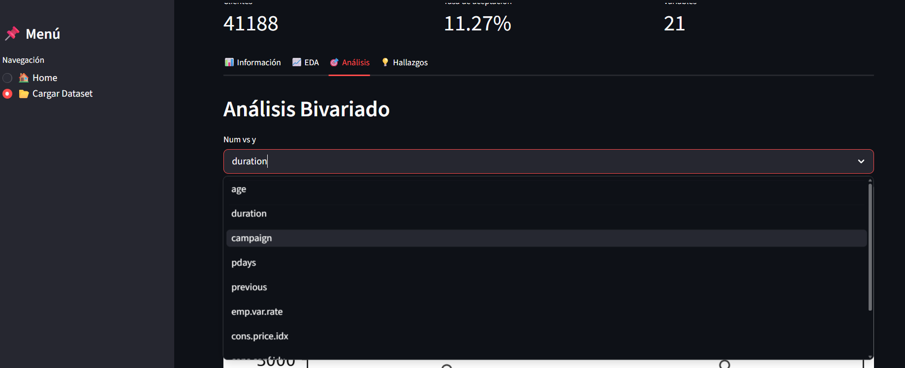

## 📊 Descripción del Proyecto
  El proyecto elaborado consiste en poder mostrar de manera dinámica los resultados de la campaña de marketing del banco, lo cual permite analizar sacar conclusiones respecto a la menor efectividad obtenida.

## ⚙️ Instrucciones de ejecución

Al entrar al siguiente enlace: https://trabajo-final-av3r7d4lblprvmdl7pjiin.streamlit.app/ usted podrá visualizar la interfaz elaborada 🏠

Asimismo y, el punto más importante será poder realizar la debida carga del archivo

Favor de dar click en "upload" y seleccionar el archivo en versión csv para el desarrollo de la aplicación:

Tener en consideración que solo aplica para archivos "csv", se detallará un mensaje luego de que el archivo se haya cargado de manera correcta

Una vez cargado el archivo se podrá visualizar variables claves y las subdivisiones elaboradas para poder un panorama más ordenado

El usuario tendrá diversas opciones para poder comparar el tipo de variable que desee, asimismo para este caso en particular, se consideró necesario aplicar análisis bivariados, diversos tipos de gráficas que permitan visualizar el comportamiento de las variables numéricas y categóricas ubicadas tanto en EDA como Análisis.

  
  

